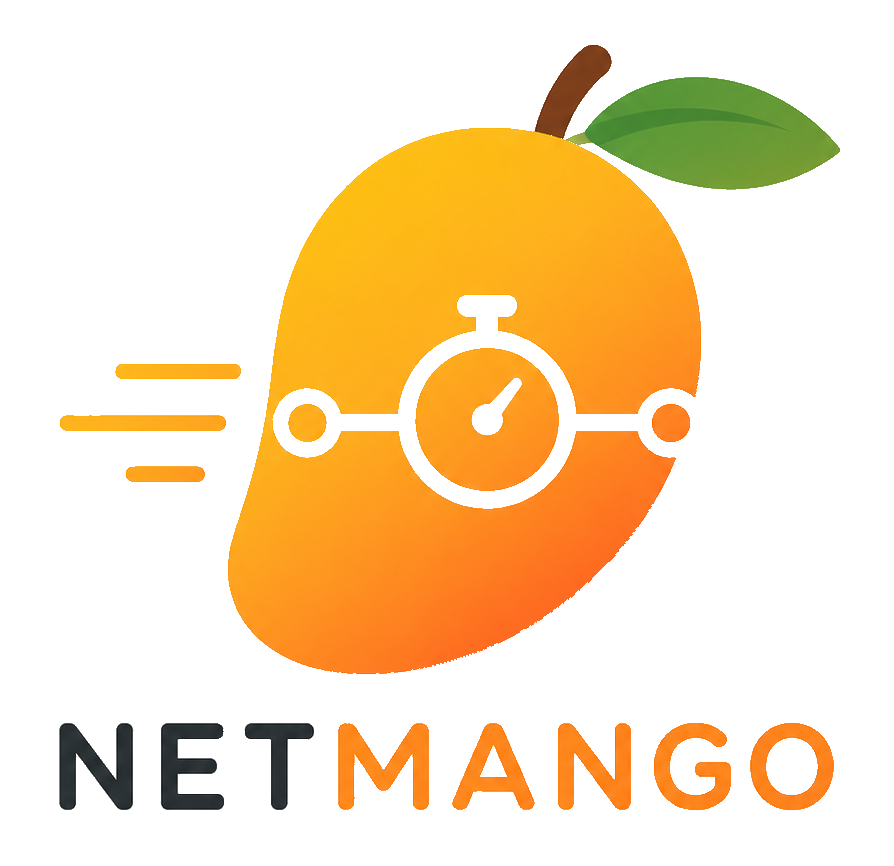
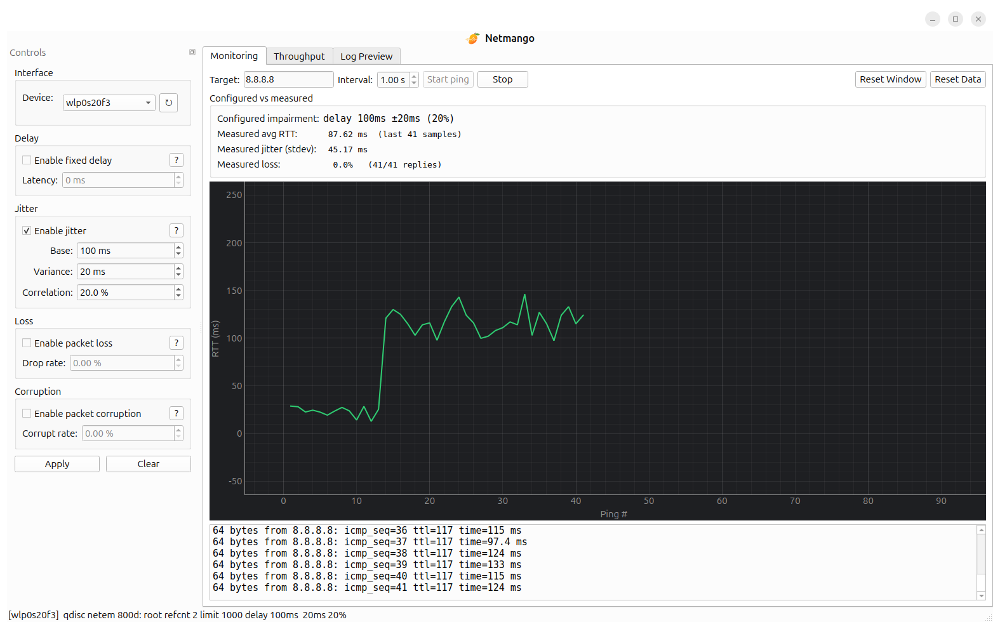

<p align="center">
  
</p>

<p align="center">
  <em>A user-friendly Linux Network Emulator.</em>
</p>

---

## Why Netmango?

This started back when I was helping out on a remote-controlled robot project as a fresh ICT master's student. The robot talked to its operator over Wi-Fi, and on paper everything worked great. However, the moment we drove it a little further away, or around an obstacle, it started behaving
funny 🥴.

To make the control loop more robust, we needed a way to **reproduce
messy links on demand**. Although Linux has a
`netem` for this, but it isn't friendly to use:
limited functionality, long commands, easy to mistype, and if you forget to undo your rule, your
Wi-Fi just stays broken.

So I built **Netmango**: a small, friendly Python app that lets you
emulate and monitor the messy real-world network conditions your device will actually
face out in the wild 🥭. With it you can:

- pick the interface you want to mess with,
- add delay, jitter, packet loss, and corruption with a few clicks,
- watch your link quality and throughput live while you test,
- and just close the window when you're done - Netmango cleans up after
  itself, no leftover rules.

Netmango is packaged on PyPI: install it with pip or run it straight from source. Give it a try and say goodbye to wrestling with netem 🍻!

---

## APP Screenshot
<p align="center">
  
</p>

---

## Quick start

## 01. Prerequisites

Netmango runs on Debian / Ubuntu and relies on a few common system packages. You need to install them first: 

```bash
sudo apt update
sudo apt install -y \
    python3 python3-venv \
    iproute2 iputils-ping \
    libxcb-cursor0
```

### 02. Option A — install from PyPI (recommended)
On modern Ubunut, Python apps from PyPi are suggested to isntall into dedicated vitual environment, so install as following:

**a. Create the virtual environment** (the first time):

```bash
python3 -m venv ~/.venvs/netmango
```

**b. Install Netmango into it** (the first time):

```bash
~/.venvs/netmango/bin/pip install netmango
```

**c. Launch the GUI** — this is the only command you need from now on:

```bash
sudo ~/.venvs/netmango/bin/netmango
```

**d. Easy launch [Optional]** — If you feel the command in Step 3 is difficult to remember, you can add one line to `~/.bashrc`:

```bash
nano bashrc
alias netmango='sudo ~/.venvs/netmango/bin/netmango'
save
```
After restarting your terminal, you can launch the software by typing `netmango`.

**e. To uninstall** — Simply `rm -rf ~/.venvs/netmango`.

### 03. Option B — Run from the source code

```bash
# Clone the repo
cd netmango
./start.sh
```

That's it. `start.sh` will:

1. Create `.venv/` if it doesn't exist.
2. Install the project in editable mode on the first run.
3. Launch the GUI (`python -m netmango`).

To stop, just click the **×**. Netmango automatically removes any rule it
applied.

### Question: Why it needs Sudo ?

Netmango uses `tc`, which is a Linux kernel feature and needs root, so it
will prompt for your sudo password the first time you apply a rule.

---

## Author

I'm **Mengge Zhang**, an ICT master's student at KU Leuven. Netmango
is a personal project, fully open source. I like to use what I learned to solve realworld challenges. Happy shaping! 🥭

I'm currently looking for opportunities to pursue a PhD, so feel free to get in touch!
